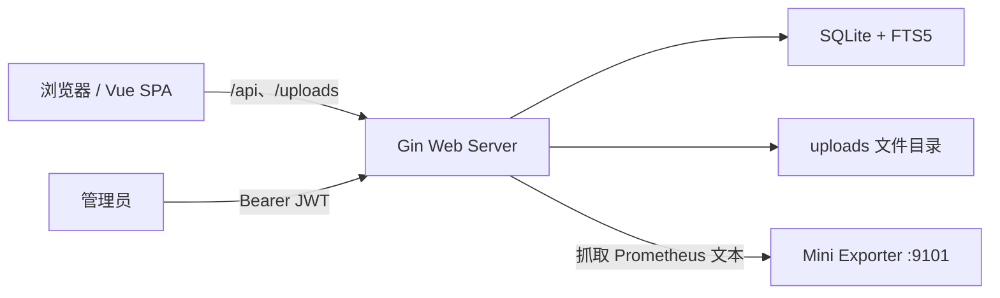

# Blog2

一个使用 Vue 3、Gin、SQLite 和 Prometheus Go Client 构建的个人博客系统。

项目支持 Markdown 文章上传、在线编辑、历史版本恢复、标签与全文搜索、RSS、站点地图、主题定制、数据备份，以及仅管理员可见的 CPU/内存监控和私人服务导航。

## 技术栈

| 层级 | 技术 |
| --- | --- |
| 前端 | Vue 3、TypeScript、Vite、Vue Router、Pinia、Tailwind CSS、Axios |
| 后端 | Go 1.22、Gin、GORM、Viper、Goldmark |
| 数据库 | SQLite、WAL、FTS5 |
| 鉴权 | JWT（HS256）、bcrypt |
| 监控 | Prometheus Go Client、自研 mini exporter |
| 部署 | Docker 多阶段构建、GitHub Actions、GHCR |

## 架构



开发环境中，Vite 和 Gin 分别运行，Vite 将 `/api` 与 `/uploads` 代理到后端。生产镜像会先构建 Vue，再把 `dist` 复制到 Go 的 `frontend-dist`，最后通过 `embed.FS` 嵌入后端二进制，因此部署时只需要一个应用容器。

## 本地开发

### 1. 启动后端

```powershell
cd backend
go mod download
go run .
```

默认地址：`http://127.0.0.1:8080`。

如果 `8080` 被占用，可以临时改端口：

```powershell
$env:PORT="8081"
go run .
```

### 2. 启动前端

```powershell
cd frontend
npm install
npm run dev
```

默认页面：`http://127.0.0.1:5173`。

后端不是 `8080` 时，通过环境变量指定代理目标：

```powershell
$env:VITE_BACKEND_URL="http://127.0.0.1:8081"
npm run dev
```

### 3. 登录后台

本地 `config.yml` 的默认账号为 `admin / admin`。该配置只适合开发，部署前必须覆盖 `JWT_SECRET` 和 `ADMIN_PASSWORD`。

## Docker

```bash
docker compose up -d --build
docker compose ps
docker compose logs -f blog
```

容器端口：

- `8080`：博客和 API。
- `9101`：Prometheus metrics。

持久化卷：

- `blog-data`：SQLite 数据库。
- `blog-uploads`：文章图片、封面、背景和头像。

## 文档

- [前端开发说明](docs/frontend.md)
- [后端与 API 说明](docs/backend.md)
- [配置说明](CONFIGURATION.md)
- [阿里云 HTTPS 部署](docs/https-deployment.md)
- [HTTPS 工作流程说明](docs/https-flow.md)
- [Prometheus 文本格式学习笔记](docs/prometheus-text-format-guide.md)

## 发布流程

向 `main` 或 `master` 推送后，GitHub Actions 构建 Docker 镜像并发布：

```text
ghcr.io/<仓库所有者>/blog:latest
ghcr.io/<仓库所有者>/blog:<commit-sha>
```

生产环境建议使用固定 SHA 标签回滚，`latest` 用于常规更新。
