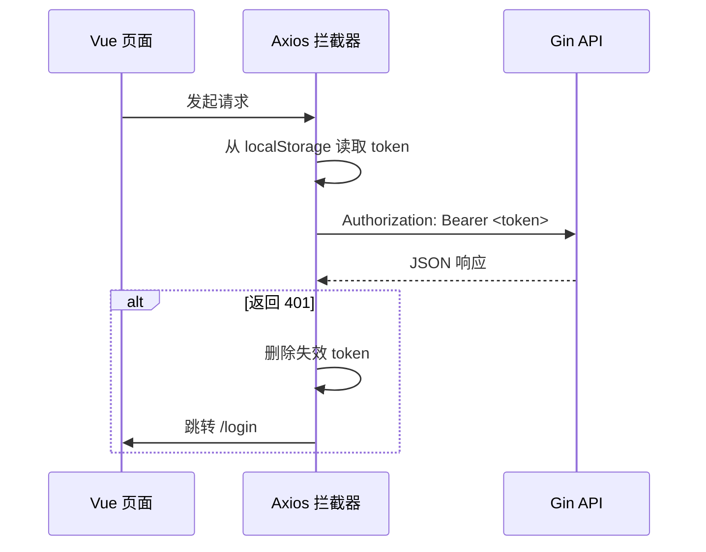

# 前端开发说明

## 1. 定位

前端是 Vue 3 单页应用，负责公开阅读页面、文章搜索与归档、管理员登录、文章管理、在线编辑、系统监控和私人服务导航。

开发时由 Vite 提供热更新；生产构建结果会嵌入 Go 后端，不需要单独运行 Node.js 服务。

## 2. 目录结构

```text
frontend/
├─ public/                 静态图标与默认 Go Gopher
├─ src/
│  ├─ components/         可复用展示和交互组件
│  ├─ composables/        站点设置、主题和显示模式状态
│  ├─ layouts/            全局导航、背景、页脚
│  ├─ router/             页面路由和前端登录守卫
│  ├─ stores/             Pinia 鉴权与文章数据
│  ├─ utils/              Axios、颜色和深浅主题工具
│  ├─ views/              路由级页面
│  ├─ App.vue             根布局
│  └─ main.ts             Vue、Pinia、Router 初始化
├─ vite.config.ts         开发代理
└─ tailwind.config.js     样式配置
```

## 3. 页面路由

| 路径 | 页面 | 说明 |
| --- | --- | --- |
| `/` | `HomeView` | 根据显示模式切换经典首页和简洁首页 |
| `/posts` | `PostsView` | 已发布文章列表、标签筛选、分页 |
| `/post/:slug` | `PostDetailView` | 阅读、目录、阅读进度、导出；管理员可编辑 |
| `/timeline` | `TimelineView` | 按年月归档 |
| `/tags` | `TagsView` | 标签统计 |
| `/search` | `SearchView` | SQLite FTS5 全文搜索入口 |
| `/monitor` | `MonitorView` | 管理员系统监控，5 秒刷新一次 |
| `/services` | `ServicesView` | 管理员私人服务入口，首项连接当前主机的 8000 端口 |
| `/login` | `LoginView` | 管理员登录 |
| `/admin` | `AdminView` | 文章、外观、语句、版本和备份管理 |

`/admin` 和 `/services` 使用路由守卫检查本地 token。`/monitor` 页面会自行显示“无权限”，而其数据 API 仍由后端 JWT 中间件强制保护。登录后顶部导航才显示“私人服务”。

## 4. 组件职责

| 组件 | 职责 |
| --- | --- |
| `DefaultLayout.vue` | 全局导航、背景层、内容宽度、页脚和装饰 |
| `DisplayModeToggle.vue` | 切换资讯版/经典版并持久化选择 |
| `PostCard.vue` | 卡片版和紧凑列表版文章摘要 |
| `MarkdownRenderer.vue` | 展示后端生成的 HTML并处理代码高亮 |
| `TOCSidebar.vue` | 展示后端生成的目录 JSON，阅读时保持可见 |
| `UploadZone.vue` | 本地选择或拖放 Markdown 与图片，提交 multipart 表单 |
| `ThemeToggle.vue` | 深色/浅色模式切换 |
| `ThemePreset.vue` | 管理员调整站点配色预设 |

## 5. 状态管理

### Pinia

- `auth.ts`：保存 token 和登录状态，提供 `login`、`logout`。
- `posts.ts`：文章列表、总数、加载状态和单篇文章请求。

### Composables

- `useSiteTitle`：站点标题。
- `useSiteAvatar`：站点头像。
- `useBackgroundImage`：背景图片和遮罩透明度。
- `useCustomTheme`：颜色预设。
- `useDisplayMode`：经典版/简洁版。
- `useClassicTheme`：经典版角色主题及本地选择状态。

站点设置优先从 `/api/settings` 读取，并以 `localStorage` 作为前端缓存。管理员修改后通过 `PUT /api/admin/settings` 保存到 SQLite。

## 6. 请求与 JWT

所有 API 请求通过 `src/utils/api.ts` 的 Axios 实例发送：



登录成功后 token 存入 `localStorage`。因此前端的“已登录”只控制界面展示，真正的权限判断始终由后端完成。

## 7. 文章阅读与编辑

公开用户可以：

- 阅读已发布文章。
- 使用文章目录和阅读进度条。
- 下载 Markdown 原文。
- 按标签、时间线或全文搜索查找文章。

管理员登录后，阅读页额外显示：

- 在线修改标题和 Markdown。
- 从本地选择 `.md` 覆盖编辑器内容。
- 保存文章并自动创建历史版本。

编辑保存调用：

```http
PUT /api/admin/posts/:id/content
Authorization: Bearer <token>
Content-Type: application/json

{
  "title": "文章标题",
  "content": "# Markdown 内容"
}
```

## 8. Markdown 上传

`UploadZone` 支持两种方式：

1. 点击“Select local files”，同时选择 Markdown 与图片。
2. 拖入一个完整目录，递归收集 Markdown 和图片。

前端将所有文件以同一个字段名 `file` 加入 `FormData`。后端选择第一份 `.md` 或 `.markdown` 作为文章，并把匹配到的本地图片引用替换为 `/uploads/...`。

推荐 Markdown：

```markdown
---
title: 示例文章
date: 2026-08-16
tags:
  - Go
  - Vue
---

# 示例文章

正文内容。


```

## 9. 首页模式

- `ClassicHome.vue`：头像、漂浮语句、背景和每日诗句。
- `MinimalHome.vue`：资讯版首页，包含文章信息流、站点简介、每日诗句和标签。
- `HomeView.vue`：只负责选择实际首页组件。

初次访问默认进入资讯版。切换状态保存在 `localStorage` 的 `display-mode`，值为 `classic` 或 `minimal`；用户主动切换后会记忆选择。资讯版隐藏全局背景装饰，经典版不再提供 8000 端口浮动入口。

经典版额外提供爱弥斯、守岸人、清霄和自定义四个主题选项。前三个主题分别使用本地角色背景与独立主色，选择保存在 `localStorage` 的 `classic-theme`；自定义主题继续使用管理员在后台上传的背景和配色。

首页古诗直接请求 `https://v1.jinrishici.com/all.json`。该服务不可用时不会阻塞文章页面。

## 10. 私人服务

`/services` 用于集中管理私人服务链接，目前第一项为 `SillyTavern`。链接根据当前博客地址动态生成：

```text
<当前协议>://<当前主机>:8000
```

例如通过 `http://8.13.160.110` 访问博客时，入口会打开 `http://8.13.160.110:8000`。新增服务只需扩展 `ServicesView.vue` 中的 `services` 数组。该页面仅做导航，不代理服务流量，也不替代 8000 端口自身的鉴权与防火墙配置。

## 11. 开发命令

```bash
npm install
npm run dev
npm run build
npm run preview
```

Vite 默认把 `/api` 和 `/uploads` 转发到 `http://localhost:8080`。可以覆盖：

```powershell
$env:VITE_BACKEND_URL="http://127.0.0.1:8081"
npm run dev
```

新增页面时需要：

1. 在 `src/views` 创建页面组件。
2. 在 `src/router/index.ts` 注册路由。
3. 需要导航入口时修改 `DefaultLayout.vue`。
4. 涉及管理员数据时使用 `/api/admin/*`，不要只依赖前端隐藏按钮。
