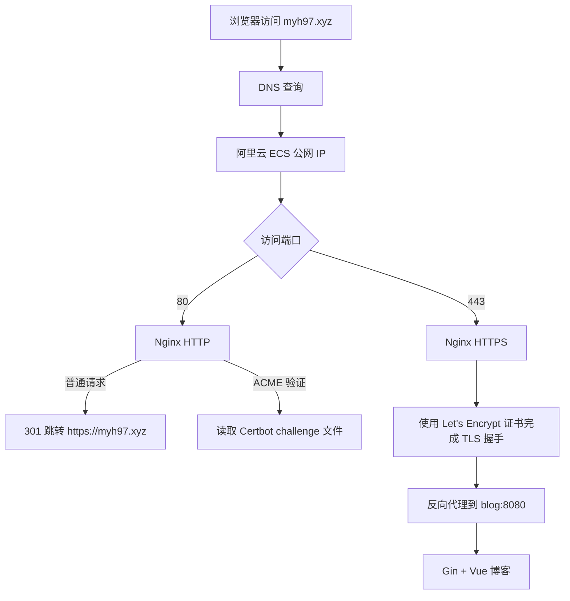
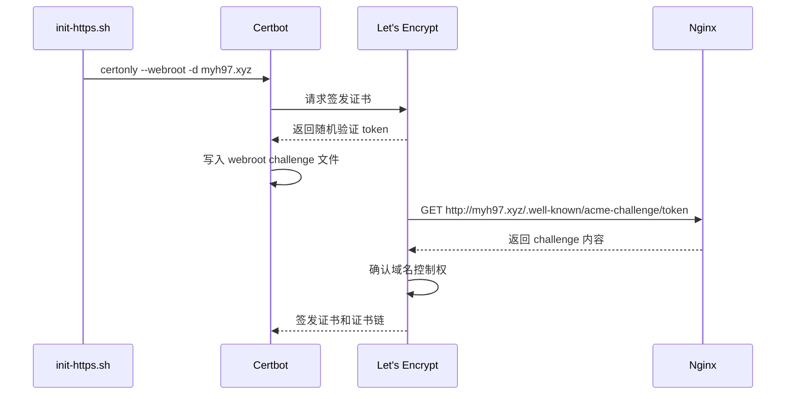
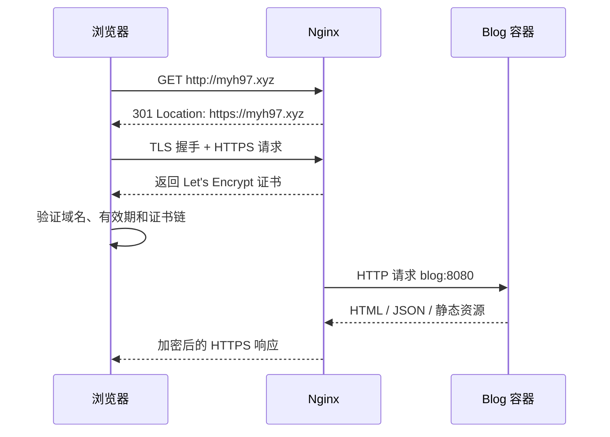

# myh97.xyz HTTPS 工作流程

## 1. 目标

让用户访问：

```text
http://myh97.xyz
```

时自动跳转到：

```text
https://myh97.xyz
```

HTTPS 在 Nginx 终止 TLS，Nginx 再通过 Docker 内部网络将请求转发给 `blog:8080`。

## 2. 参与组件

| 组件 | 职责 |
| --- | --- |
| DNS | 把 `myh97.xyz` 指向阿里云 ECS 公网 IP |
| 阿里云安全组 | 允许公网访问 TCP 80 和 443 |
| Nginx | 接收 HTTP/HTTPS、加载证书、反向代理博客 |
| Certbot | 向 Let's Encrypt 申请和续期证书 |
| Let's Encrypt | 验证域名控制权并签发公开可信证书 |
| Blog 容器 | 在 Docker 网络内监听 8080，处理页面和 API |

## 3. 总体流程



## 4. 第一步：域名解析

在 DNS 控制台设置：

```text
记录类型：A
主机记录：@
记录值：8.137.160.110
```

DNS 生效后的链路是：

```text
myh97.xyz -> 8.137.160.110 -> 阿里云 ECS
```

检查命令：

```bash
nslookup myh97.xyz
```

只有结果指向 ECS 公网 IP，Let's Encrypt 才能在正确服务器上完成验证。

> 2026-08-24 检查时，`myh97.xyz` 已通过阿里云 DNS 指向 `8.137.160.110`。

## 5. 第二步：HTTP 临时启动

首次申请证书时还没有以下文件：

```text
fullchain.pem
privkey.pem
```

因此 Nginx 不能直接加载 HTTPS 配置。`deploy/init-https.sh` 首先设置：

```text
NGINX_TEMPLATE=http.conf.template
```

然后启动 Blog 和 HTTP Nginx。此时 Nginx 提供两个能力：

1. 将普通 HTTP 请求暂时代理到博客。
2. 对外提供 `/.well-known/acme-challenge/` 验证目录。

## 6. 第三步：Certbot 申请证书

Certbot 请求 Let's Encrypt 为 `myh97.xyz` 签发证书。



HTTP-01 验证固定从公网 TCP 80 发起，所以申请和续期时必须保留 80 端口。

## 7. 第四步：证书保存

宿主机目录：

```text
/opt/blog/deploy/certbot/conf/live/myh97.xyz/fullchain.pem
/opt/blog/deploy/certbot/conf/live/myh97.xyz/privkey.pem
```

映射到 Nginx 容器后仍显示为：

```text
/etc/letsencrypt/live/myh97.xyz/fullchain.pem
/etc/letsencrypt/live/myh97.xyz/privkey.pem
```

- `fullchain.pem`：网站证书和中间证书链，可公开发送给浏览器。
- `privkey.pem`：证书私钥，必须只保存在服务器，不能提交 GitHub。

`.gitignore` 已忽略：

```text
.env.production
deploy/certbot/
```

## 8. 第五步：切换 HTTPS

证书签发后，初始化脚本重新创建 Nginx 容器，并启用：

```text
https.conf.template
```

该配置包含两个虚拟服务器：

```text
80 端口  -> 保留 ACME 验证，其他请求返回 301
443 端口 -> 加载证书，处理 HTTPS，再代理到 blog:8080
```

正常访问路径：



博客容器不需要自己处理证书，也不需要把 8080 暴露到公网。

## 9. 自动续期

Cron 每天调用：

```bash
./deploy/renew-cert.sh
```

脚本执行：

```text
certbot renew
  -> 未接近过期：不做修改
  -> 接近过期：重新完成验证并更新证书
  -> nginx -s reload：让 Nginx 读取新证书
```

重新加载 Nginx 不会销毁 Blog 容器，也不会清除 SQLite、上传文件或登录数据。

## 10. 配置与数据边界

```text
.env.production              域名、邮箱、JWT 和管理员密码
docker-compose.prod.yml      容器、端口和卷定义
deploy/nginx/*.template      HTTP 与 HTTPS Nginx 配置
deploy/certbot/www           ACME 临时验证文件
deploy/certbot/conf          证书、私钥和续期配置
blog-data                    SQLite 数据
blog-uploads                 上传图片
```

更新 Docker 镜像不会删除证书和博客数据，因为它们位于持久化目录或 Docker 卷中。

## 11. 成功判定

```bash
curl -I http://myh97.xyz
curl -I https://myh97.xyz
```

预期结果：

```text
HTTP  -> 301，Location 指向 https://myh97.xyz
HTTPS -> 200，浏览器显示有效安全锁
```

进一步检查：

```bash
docker compose --env-file .env.production -f docker-compose.prod.yml ps
docker compose --env-file .env.production -f docker-compose.prod.yml logs --tail=100 nginx
```

## 12. 常见失败点

| 现象 | 常见原因 |
| --- | --- |
| Certbot connection refused | 安全组、本机防火墙或端口 80 未开放 |
| Certbot unauthorized | DNS 没有指向当前 ECS，或 DNS 尚未生效 |
| Nginx 找不到证书 | 未完成首次申请就直接使用 HTTPS 配置 |
| HTTPS 无法访问 | 安全组 443 未开放，或 Nginx 未监听 443 |
| 页面出现 502 | Blog 容器未启动、健康检查失败或反向代理地址错误 |
| 证书更新后仍显示旧证书 | Certbot 更新后没有重新加载 Nginx |

## 13. 相关资料

- [Let's Encrypt HTTP-01 验证](https://letsencrypt.org/docs/challenge-types/)
- [Certbot webroot 与续期说明](https://eff-certbot.readthedocs.io/en/stable/using.html)
- [阿里云 ECS 安全组 80/443 配置](https://help.aliyun.com/en/ecs/user-guide/security-groups-for-different-use-cases)
- [阿里云 ICP 备案条件](https://help.aliyun.com/en/icp-filing/basic-icp-service/support/for-the-record-process-faq)
